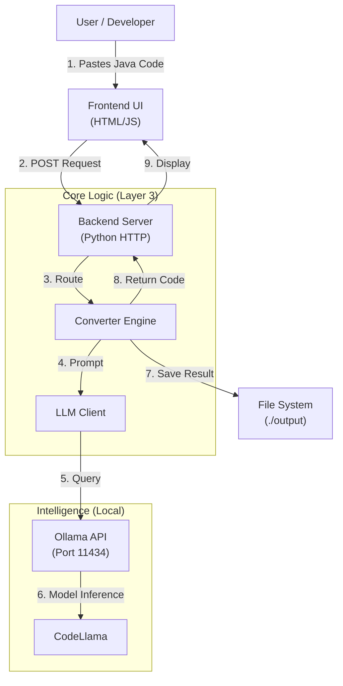

# 🚀 B.L.A.S.T. - Selenium to Playwright Converter (Local AI)

**Blueprint. Link. Architect. Stylize. Trigger.**

This project is a deterministic, self-healing automation tool designed to convert legacy **Selenium (Java)** test code into modern **Playwright (JavaScript/TypeScript)** scripts using a **Local LLM (Ollama)**.

It ensures data privacy and zero cloud costs by running entirely on your local machine.

---

## 🏗️ Architecture

The system follows the **A.N.T.** (Architecture, Navigation, Tools) 3-layer architecture.



---

## ✨ Features

- **Local-First:** Uses [Ollama](https://ollama.com/) running `codellama`. No data leaves your network.
- **Protocol Driven:** Built using the **B.L.A.S.T.** protocol for reliability.
- **Smart Conversion:** Converts implicit waits to auto-waiting, `By.id` to `page.locator`, and TestNG assertions to Jest/Expect.
- **Dark Mode UI:** A clean, developer-focused interface.

---

## 🚀 Getting Started

### 1. Prerequisites

- **Python 3.8+** installed.
- **Ollama** installed and running.
  - Download from [ollama.com](https://ollama.com).
  - Pull the model:
    ```bash
    ollama pull codellama
    ```

### 2. Installation

Clone the repository:
```bash
git clone https://github.com/RM1751/AI-Tester-Blue-Print--Selenium-To-Playwright-Convertor-Application-.git
cd AI-Tester-Blue-Print--Selenium-To-Playwright-Convertor-Application-
```

### 3. Usage

1. **Start the Server:**
   ```bash
   python tools/server.py
   ```
   You should see: `Starting server on http://localhost:8000`.

2. **Access the App:**
   - Open specific URL provided in the terminal (e.g., `http://localhost:8000`).
   - For Mobile/Remote access (on same Wi-Fi), use your PC's IP: `http://192.168.X.X:8000`.

3. **Convert:**
   - Paste your **Selenium Java** snippet.
   - Click **Analyze & Convert**.
   - The result is displayed and saved to the `output/` directory.

---

## 🌐 Remote Access (Optional)

To access this app from outside your home network, use **ngrok**:

1. Install ngrok.
2. Run: `ngrok http 8000`
3. Share the auto-generated https URL.

---

## 📂 Project Structure

- `tools/` - Python scripts for Server, LLM Client, and Converter.
- `www/` - Frontend HTML/CSS/JS.
- `output/` - Converted files are saved here.
- `architecture/` - SOPs and Prompt Strategies.
- `gemini.md` - Project Constitution and Schema.
